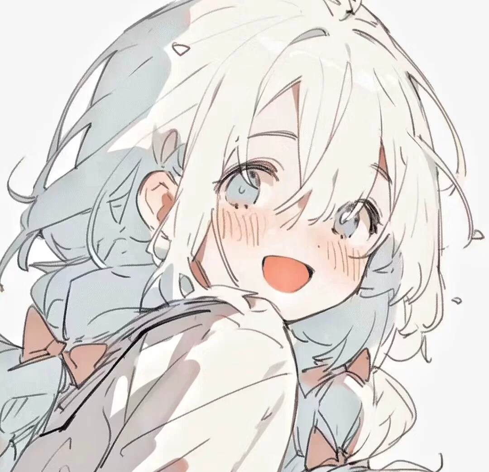

<h1>何日见原铁面板图主仓库</h1>

> 原仓库存储上限了，搞了一大堆不必要的，故对本仓库进行了整理，存储面板图的仓库更改为[面板图存储库](https://github.com/herijian1/characterpic1)，因仓库地址改变，需要重新克隆存储仓库，而不是本仓库

啥都聊的交流群[768216689](http://qm.qq.com/cgi-bin/qm/qr?_wv=1027&k=PQAshGBsq9gi1PPGrsCkHdz47Pj1zhm2&authKey=qcuZzat49QZoHvN%2FNFMp5XaDRK4l2Ngo7lz%2B9USyqEnMpLFZH4CyqqHId6mv9ZwG&noverify=0&group_code=768216689)

<div align="center">
  
  </a><br>

<h1>喵喵插件miao-plugin</h1>

[](https://gitee.com/yhArcadia/Yunzai-Bot-plugins-index) [](https://github.com/yoimiya-kokomi/Miao-Yunzai) [](https://github.com/TimeRainStarSky/Yunzai) [](https://gitee.com/yoimiya-kokomi/miao-plugin) [](https://qun.qq.com/universal-share/share?ac=1&authKey=OhXBwpnRd2oyFNIbE%2BItRHYAGj8JpSiWFVBnb4tEz6lJzXxnRzQytnMaHSEWFE4z&busi_data=eyJncm91cENvZGUiOiI3NjgyMTY2ODkiLCJ0b2tlbiI6ImNsYzl2MFNBSGxkOWFJcDJ5YnpKam9BZFZXdkFOZ0MveVliZE1pU0VVbHNqQnZGdlYvSTRvcmpPbUs0UkpaL0kiLCJ1aW4iOiIzNTEzMDIxNDYifQ%3D%3D&data=fpHkTsCy-oCPE1bMwmeYvBxo2eENJc3ZtVqXxScjLvmMYyUBVtM1A1D-qP7cSB3avC-8Gs4dh7lNXSbcvZpUhA&svctype=4&tempid=h5_group_info)<br>

</div>

### 图库说明

**本仓库仅为介绍说明，图片的存储库为[图库](https://github.com/herijian1/characterpic1)**

啬图有小部分

图库会保证每个版本角色的面板图，新角色图源少会更新慢，后期老角色图片也会有更新及筛选调整

### 食用方法

 **方便更新** 

在yunzai根目录下执行以下任一命令


使用github

```
git clone --depth=1 https://github.com/herijian1/characterpic1.git ./plugins/miao-plugin/resources/profile/
```

使用gitee
```
git clone --depth=1 https://gitee.com/herijian/characterpic1.git ./plugins/miao-plugin/resources/profile/
```

使用gitcode（更新慢）

```
git clone --depth=1 https://gitcode.com/herijian/characterpic1.git ./plugins/miao-plugin/resources/profile/
```

若克隆仓库失败，先删除miao-plugin/resources/profile目录下原有的normal-character文件夹

### 更新方法

这几个方法除了1都挺方便的

**方法1**
更新时进入目录`Yunzai/plugins/miao-plugin/resources/profile`后执行git pull即可

**方法2**
直接给机器人发 `#更新miao-plugin/resources/profile`喵崽不知道是否可行

**方法3**
安装面板图库更新插件，yunzai根目录执行
```
curl -o "./plugins/example/面板图库更新.js" "https://gitee.com/herijian/characterpic/raw/master/面板图库更新.js"
```
发送#更新面板图库 即可更新，每天凌晨3-4点随机时间进行自动更新
> Tip：如果未安装面板图库无法使用，请确保已克隆面板图仓库

**方法4**
如果是linux系统，有trss插件可以直接使用rc指令安装，对机器人发送
```
rc rm -r plugins/miao-plugin/resources/profile/normal-character && cd plugins/miao-plugin/resources/profile && git clone https://gitee.com/herijian/characterpic1.git
```
该命令中使用的仓库地址可更换为github，gitcode源

更新时对机器人发送
```
rc cd plugins/miao-plugin/resources/profile && git pull
```

 ### 手动安装方法（不方便更新）

随便找个地方克隆图库 或 直接下载压缩包
```
git clone https://gitee.com/herijian/characterpic1.git
```

### 存放位置
手动方法下载的将normal-character文件夹放在Yunzai/plugins/miao-plugin/resources/profile目录下

**可选** 彩蛋图存放位置
Yunzai/plugins/miao-plugin/resources/profile/super-character

### 免责声明
* **请勿将此模板图库用于任何以盈利为目的的场景.** 
* **图片与其他素材均来自于网络，部分图片为付费商业素材，图片资源严禁用于任何商业用途。如有侵权请联系删除。已购买素材仅用于展示用途，何日见不拥有其版权后续使用或传播行为与本项目无关。**

### 联系方式

* QQ：[351302146](https://qm.qq.com/q/3Li0J4Vuze)

* 群号：[768216689](https://qun.qq.com/universal-share/share?ac=1&authKey=OhXBwpnRd2oyFNIbE%2BItRHYAGj8JpSiWFVBnb4tEz6lJzXxnRzQytnMaHSEWFE4z&busi_data=eyJncm91cENvZGUiOiI3NjgyMTY2ODkiLCJ0b2tlbiI6ImNsYzl2MFNBSGxkOWFJcDJ5YnpKam9BZFZXdkFOZ0MveVliZE1pU0VVbHNqQnZGdlYvSTRvcmpPbUs0UkpaL0kiLCJ1aW4iOiIzNTEzMDIxNDYifQ%3D%3D&data=fpHkTsCy-oCPE1bMwmeYvBxo2eENJc3ZtVqXxScjLvmMYyUBVtM1A1D-qP7cSB3avC-8Gs4dh7lNXSbcvZpUhA&svctype=4&tempid=h5_group_info)

* 投喂：[爱发电](https://afdian.com/a/herijian)

**点点⭐Star⭐吧**
